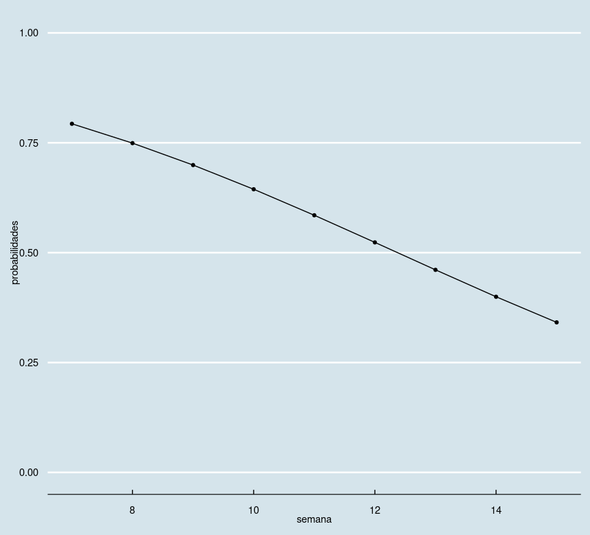

# Semana del 24 de octubre

**Importante** Continúa el *hacktoberfest*. Buscad *issues* en GitHub con la
etiqueta *hacktoberfest* en todo GitHub y GitLab. Recordad añadir
`hacktoberfest` como topic de vuestro repositorio, para que beneficie a quien
vaya a trabajar en él.

Por ejemplo, en [el material de la asignatura](https://github.com/JJ/IV).

Seguimos aconsejando muy vivamente la asistencia a clase, especialmente para
quien esté trabajando en los objetivos cero o uno.

## Antes de la clase

En el curso 2021-22,

* El 50% había entregado ya el [objetivo
  2](https://jj.github.io/IV/documentos/proyecto/2.Entidad).
* El 90% ya había entregado el [objetivo
  1](http://jj.github.io/IV/documentos/proyecto/1.Infraestructura), y el 50% lo
  había superado.

Todas las *personas que aprobaron* habían superado el objetivo 0. Si todavía no
has superado el objetivo 0, aconsejamos que te planifiques el resto de la
asignatura para la [convocatoria
extraordinaria](instrucciones-ordinaria-extraordinaria.md).

Por otro lado, la probabilidad de aprobar en la convocatoria extraordinaria
según la semana de *entrega* del objetivo 3 sigue el siguiente gráfico

Por lo que sería *extremadamente conveniente* que en planificara la finalización
de los objetivos anteriores y la entrega del 3 *lo antes posible* y siempre
antes de la **semana número 12** (principios de diciembre).

## Errores comunes (para referencia)

Es importante que recordéis que **hay que superar hasta el objetivo 5 para aprobar la
asignatura**, en la convocatoria ordinaria o la extraordinaria. El estudiante
tendrá que acomodar su ritmo de trabajo a este plan, ya que los objetivos se
pueden entregar cuando se desee, con la salvedad de que hay que entregarlos de
forma secuencial. Por lo tanto, un *error común* es no haber entregado, a estas
alturas, el objetivo 2 tras haber superado el uno (tan común como el 88% de la
clase).

* Todos los objetivos a partir del 1
  * El repositorio debe describir un proyecto, no entregas de una asignatura. Se
    deben evitar referencias a "objetivos", porque los objetivos son etapas que
    hay que cubrir en el proyecto. En todo caso, debería organizarse la
    documentación en milestones, pero lo correcto es organizarla para que una
    persona que quiera usar el proyecto en el estado actual pueda hacerlo.
  * Evitar incluir en el PR cambios o ediciones que correspondan a mejoras del
    objetivo anterior. El PR debe incluir sólo lo necesario para superar el
    objetivo que se esté evaluando.
* Objetivo 1
  * En general, cada milestone/PMV corresponde a un paso en el desarrollo de un
    producto. En el caso de nuestra asignatura, están condensados. Pero
    *siempre* hay que empezar por entender el problema haciendo un modelo del
    mismo, usando la metodología de *design thinking* o algún otro enfoque
    sistemático que pase del dominio del problema a la implementación. Sin este
    modelo (cuyo producto tendrá que tener la forma de código, que además
    compile), no se puede pasar al milestone siguiente.

## Otras sesiones

* [Sexta semana](semana-06.md)
* [Octava semana](semana-08.md)

