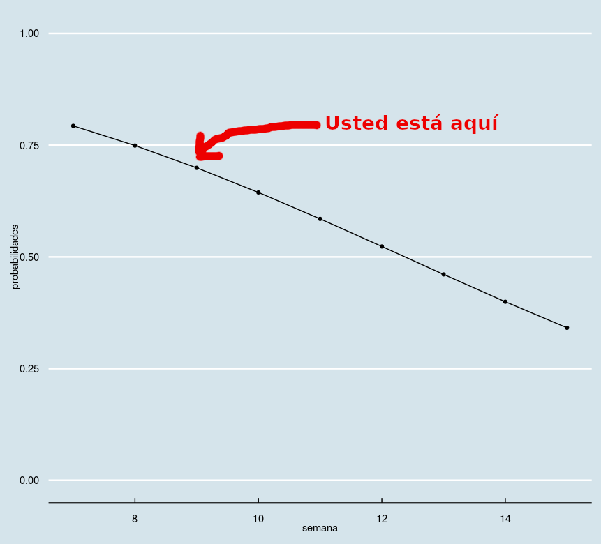

# Semana del 7 de Noviembre

## Antes de la clase

Todas las *personas que aprobaron en la convocatoria ordinaria* habían superado el objetivo 1. Si todavía no
has superado este objetivo, aconsejamos que te planifiques el resto de la
asignatura para la convocatoria extraordinaria.

## Estado de los objetivos

```

 0 🧮:  8%🚧 78%✅ 14%❌ ⇒
     🚧 🚧 🚧 🚧
     ✅ ✅ ✅ ✅ ✅ ✅ ✅ ✅ ✅ ✅ ✅ ✅ ✅ ✅ ✅ ✅ ✅ ✅ ✅ ✅ ✅ ✅ ✅ ✅ ✅ ✅ ✅ ✅ ✅ ✅ ✅ ✅ ✅ ✅ ✅ ✅ ✅ ✅ ✅
     ❌ ❌ ❌ ❌ ❌ ❌ ❌
 1 🧮: 10%🚧 60%✅ 30%❌ ⇒
     🚧 🚧 🚧 🚧 🚧
     ✅ ✅ ✅ ✅ ✅ ✅ ✅ ✅ ✅ ✅ ✅ ✅ ✅ ✅ ✅ ✅ ✅ ✅ ✅ ✅ ✅ ✅ ✅ ✅ ✅ ✅ ✅ ✅ ✅ ✅
     ❌ ❌ ❌ ❌ ❌ ❌ ❌ ❌ ❌ ❌ ❌ ❌ ❌ ❌ ❌
 2 🧮:  8%🚧 32%✅ 60%❌ ⇒
     🚧 🚧 🚧 🚧
     ✅ ✅ ✅ ✅ ✅ ✅ ✅ ✅ ✅ ✅ ✅ ✅ ✅ ✅ ✅ ✅
     ❌ ❌ ❌ ❌ ❌ ❌ ❌ ❌ ❌ ❌ ❌ ❌ ❌ ❌ ❌ ❌ ❌ ❌ ❌ ❌ ❌ ❌ ❌ ❌ ❌ ❌ ❌ ❌ ❌ ❌
 3 🧮:  2%🚧 16%✅ 82%❌ ⇒
     🚧
     ✅ ✅ ✅ ✅ ✅ ✅ ✅ ✅
     ❌ ❌ ❌ ❌ ❌ ❌ ❌ ❌ ❌ ❌ ❌ ❌ ❌ ❌ ❌ ❌ ❌ ❌ ❌ ❌ ❌ ❌ ❌ ❌ ❌ ❌ ❌ ❌ ❌ ❌ ❌ ❌ ❌ ❌ ❌ ❌ ❌ ❌ ❌ ❌ ❌
 4 🧮:  4%🚧  4%✅ 92%❌ ⇒
     🚧 🚧
     ✅ ✅
     ❌ ❌ ❌ ❌ ❌ ❌ ❌ ❌ ❌ ❌ ❌ ❌ ❌ ❌ ❌ ❌ ❌ ❌ ❌ ❌ ❌ ❌ ❌ ❌ ❌ ❌ ❌ ❌ ❌ ❌ ❌ ❌ ❌ ❌ ❌ ❌ ❌ ❌ ❌ ❌ ❌ ❌ ❌ ❌ ❌ ❌
 5 🧮:  2%🚧  2%✅ 96%❌ ⇒
     🚧
     ✅
     ❌ ❌ ❌ ❌ ❌ ❌ ❌ ❌ ❌ ❌ ❌ ❌ ❌ ❌ ❌ ❌ ❌ ❌ ❌ ❌ ❌ ❌ ❌ ❌ ❌ ❌ ❌ ❌ ❌ ❌ ❌ ❌ ❌ ❌ ❌ ❌ ❌ ❌ ❌ ❌ ❌ ❌ ❌ ❌ ❌ ❌ ❌ ❌
 6 🧮:  2%🚧  0%✅ 98%❌ ⇒
     🚧

     ❌ ❌ ❌ ❌ ❌ ❌ ❌ ❌ ❌ ❌ ❌ ❌ ❌ ❌ ❌ ❌ ❌ ❌ ❌ ❌ ❌ ❌
     ❌ ❌ ❌ ❌ ❌ ❌ ❌ ❌ ❌ ❌ ❌ ❌ ❌ ❌ ❌ ❌ ❌ ❌ ❌ ❌ ❌ ❌
     ❌ ❌ ❌ ❌ ❌
```

Este era [el estado en la semana equivalente el año
pasado](https://github.com/JJ/IV-21-22/blob/master/sesiones/semana-09.md).

## Objetivos

1. Entender el flujo HU → hito → issue → mensaje de commit → código y cómo es
   importante para auto-documentar el código y para aportar valor al
   cliente.
2. Entender cómo el diseño dirigido por dominio ayuda a modelizar un
   problema y convertirlo en estructuras de datos que ayuden a resolverlo.
3. Establecer un marco para toma de decisiones sobre herramientas a usar en el
   proyecto, de forma que se dejen abiertas las opciones y se decida de forma
   objetiva.

## Errores frecuentes

* **No se puede cerrar un issue desde el botón**, o dará error en todos los
tests. Siempre se cierra desde un commit (o desde un PR, que crea un commit al
fusionarse).

* *Usad **de verdad** la lista de comprobación*. Si marcáis algo que no habéis
  hecho, es doble trabajo para la persona que corrige, que tiene que comprobar
  que efectivamente lo habéis hecho, y para vosotros que tendréis en muchos
  casos que empezar desde cero.

### Objetivo 2

Como ya hemos dicho, lo principal en este objetivo es seguir la metodología que
permita añadir valor con el código a lo que quiere el cliente.

* Si los issues están mal, *el código ni siquiera se puede decir que esté
  mal*. Si los issues están mal hechos, por tanto, *hay que comenzar desde cero
  a plantear los problemas  y escribir el código resolviéndolos*. No se puede simplemente
  cambiar los issues.
* Volviendo a la lista de comprobación, en este caso la persona que sea
  propietaria del repositorio tiene  *también* que pasar la lista de
  comprobación sobre el código hecho.

### Objetivo 3

Probabilidades de aprobar en convocatoria extraordinaria según semana de
*entrega* de este objetivo:



* Poner descripciones de las herramientas aleatorias, redundantes y totalmente
  irrelevantes para su elección o no como tal herramienta.
* Poner criterios y luego decir que eliges uno u otro por una razón totalmente
  aleatoria.
* En cualquier lenguaje de programación siempre se podrán tener en consideración
  herramientas genéricas como `make`.

## Material para clase

Guiones de objetivos en vigor:

* [Objetivo 2](https://jj.github.io/IV/documentos/proyecto/2.Entidad).
* [Objetivo 3:
  automatización](http://jj.github.io/IV/documentos/proyecto/3.Automatizar)
* [Objetivo 4: test unitarios](http://jj.github.io/IV/documentos/proyecto/4.Tests)
* [Objetivo 5: contenedores para
  pruebas](http://jj.github.io/IV/documentos/proyecto/5.Docker)


Presentaciones relativas al objetivo 3:
* [Presentación](https://jj.github.io/IV/preso/gestores-deps.html) sobre
  gestores de dependencias.
* [Presentación](https://jj.github.io/IV/preso/gestores-tareas.html).

Tanto al tres como al cuatro:
* [Presentación sobre criterios para elección de herramientas](https://jj.github.io/IV/preso/criterios-herramientas.html).

## Otras sesiones

* [Octava semana](semana-08.md)
* [Décima semana](semana-10.md)

